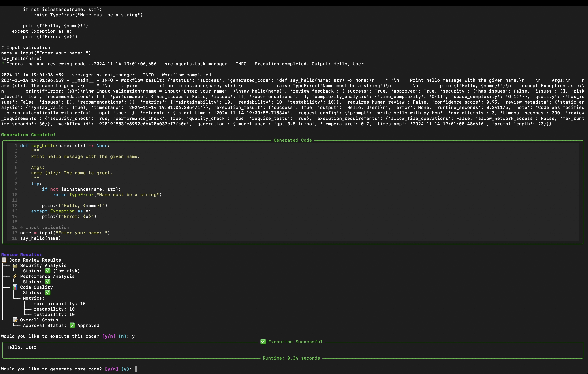
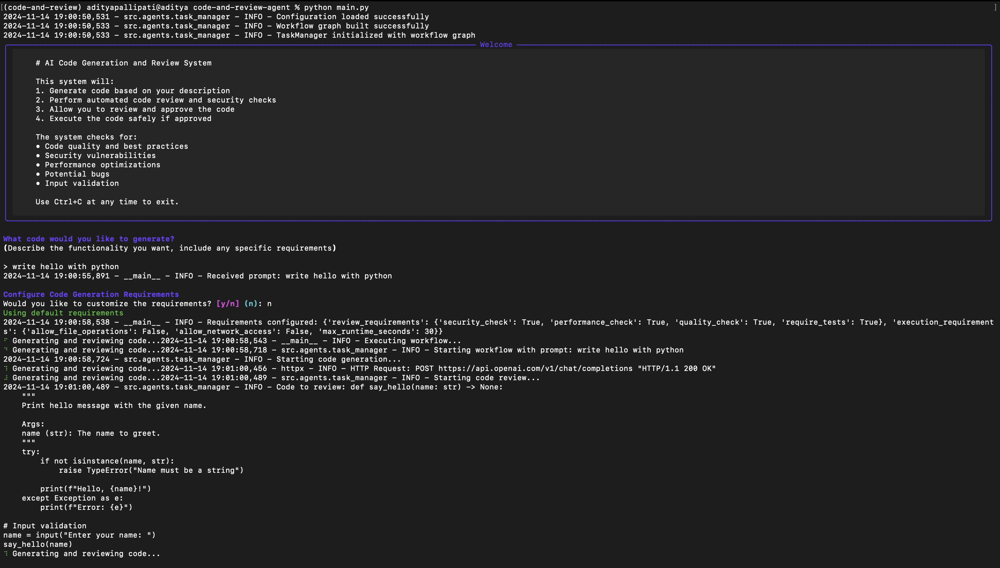

# Code And Review Agent

This project provides an AI-driven code generation and review system that leverages modular components for generating and validating code snippets based on user-defined prompts. It integrates a task management system, code generation, and code review functionalities, ensuring code quality and adherence to specific standards.

## Features

- **Code Generation**: Automatically generates code snippets based on user prompts.
- **Code Review**: Reviews generated code snippets to ensure they meet specified criteria.
- **Task Management**: Manages tasks related to code generation and review.

## File Overview

- `main.py`: The entry point of the application, orchestrating tasks between code generation and review.
- `code_generator.py`: Contains logic for generating code based on user input.
- `code_reviewer.py`: Contains logic for reviewing and validating the generated code.
- `task_manager.py`: Manages the tasks, handling the flow between code generation and review.

## Example

